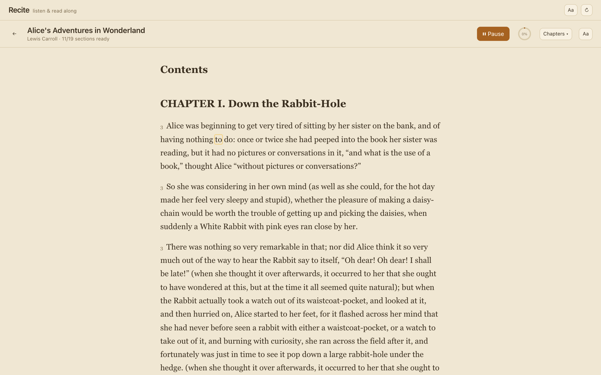
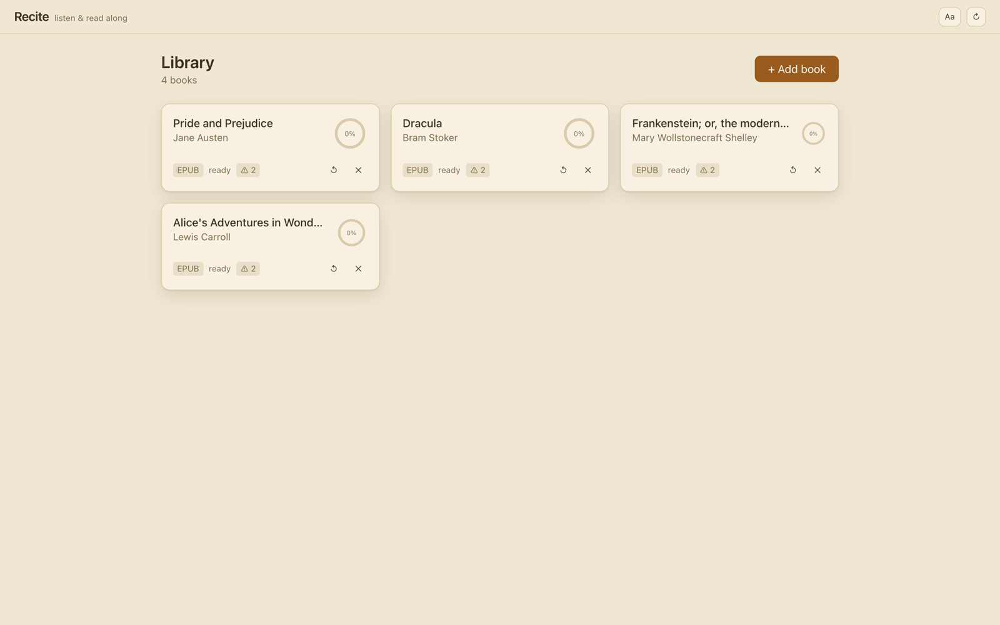
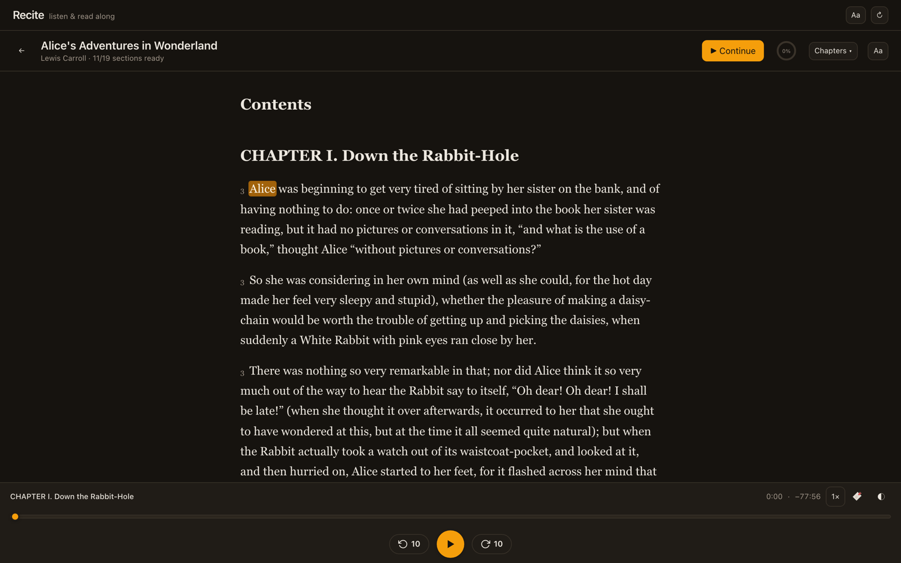

# Recite

[](LICENSE)
[](backend/requirements.txt)
[](frontend/package.json)

Recite is a local, privacy-first read-along audiobook player. Drop a PDF or
EPUB from your library into it and Recite narrates the book with a
fully-offline neural voice while the text lights up word-by-word, karaoke
style. Nothing leaves your machine: synthesis runs locally via
[Kokoro-82M](https://huggingface.co/hexgrad/Kokoro-82M), timings are stored
locally, and the only network traffic is the one-time model download.

<p>
  
</p>
<p>
  
  
</p>

## Features

- **Karaoke read-along** — the highlighted word tracks the narration; click
  any word to seek there, or scrub the transport bar.
- **Fully local TTS** — Kokoro-82M runs on your machine; no accounts, no API
  keys, no telemetry.
- **PDF & EPUB ingest** — two-column PDFs, heading-based sections, hyphen
  rejoining, and refusal of image-heavy scans with a clear message.
- **Read now, generate ahead** — sections near your position synthesize
  first (lane 1) while the rest of the book renders in the background
  (lane 2); narration starts while later parts are still rendering.
- **Reading tools** — bookmarks, four-color text highlights, ±10 s skips,
  speed control with pitch preservation, chapter jumps (`J`/`L`), and
  per-book resume.
- **Reader comfort** — sepia/light/dark themes, font family and size, line
  height, highlighter or underline styles.
- **Live status** — section synthesis progress streams over SSE, so the
  reader shows `pending → synthesizing → ready` as audio lands.

## Quick start

```bash
make install            # creates .venv, installs backend + frontend deps
make dev                # backend + vite, opens http://localhost:5173
```

Prereqs: Python 3.12, Node ≥ 18, ffmpeg, espeak-ng (`brew install espeak-ng`).
First synthesis downloads the Kokoro model (~330 MB) once.

Production mode serves the built SPA from the backend, single port:

```bash
make build
make run                # http://localhost:8744
```

## Workflow

1. Add books from your library dir (default `~/Documents/BOOKS`;
   image-heavy PDFs are refused with a clear message).
2. Open a book — the first sections synthesize ahead of your reading
   position while the rest generates in the background.
3. Read along: the highlighted word tracks the audio; click any word or
   section, scrub, or press `J`/`L` to jump chapters.

Data lives under the data dir (default
`~/Library/Application Support/recite/` on macOS: SQLite + per-book audio).
Delete it to reset the app. Every path is env-overridable:

| Variable | Default | Purpose |
| --- | --- | --- |
| `RECITE_DATA_DIR` | `~/Library/Application Support/recite` | db + generated audio |
| `RECITE_BOOKS_DIR` | `~/Documents/BOOKS` | read-only input library |
| `RECITE_HOST` / `RECITE_PORT` | `127.0.0.1` / `8744` | server bind |
| `RECITE_TTS_WORKERS` | `6` | concurrent Kokoro pipelines |
| `RECITE_TTS_WINDOW_CHUNKS` | `80` | audio kept ready past the cursor |
| `RECITE_TTS_GRACE` | `480` | seconds out-of-window work stays queued |
| `RECITE_FFMPEG` / `RECITE_FFPROBE` | from `PATH` | encoder binaries |

## Layout

```
backend/  FastAPI: ingest (PyMuPDF/EPUB), Kokoro TTS queue, timings, SSE, REST
frontend/ React + Vite + TS + Tailwind + zustand
docs/     CONTRACT.md — data schemas, API routes, player invariants
tests/    pytest (ingest, TTS, API); frontend has vitest
```

## Tests

```bash
make test
```

The ingest decision boundary (what counts as a readable book vs an
image-heavy scan) is pinned by deterministic generated fixtures — see
`backend/tests/test_ingest_boundary.py`.

## Design notes

- One MP3 per section; word timings are section-relative ms. Playback is a
  single `<audio>` element with one seek path — Tauri-wrap-ready (all URLs
  relative).
- Word timings come from WhisperX forced alignment when installed
  (`whisperx`, `ctranslate2`), otherwise pause-budget interpolation, which
  re-zeros every chunk.
- The full data model, API surface, and player invariants are specified in
  [docs/CONTRACT.md](docs/CONTRACT.md).

## License

[MIT](LICENSE)
